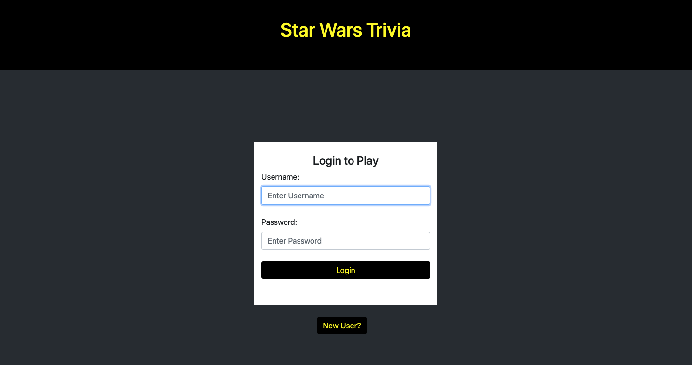

# Star Wars Trivia Front End

## Project Description
In this web based trivia game, players are asked questions about different Star Wars topics and they must get as many correct answers as possible. Success is incentivized by potential to earn rewards. Players can register and sign up to participate in the leader board and character showcase. Players are issued character elements to premiere in their showcase, gain additional options as they play the game.

## Technologies Used
* Angular
	* HTML
	* CSS
	* Bootstrap
	* TypeScript
	* NodeJS
* Visual Studio Code
* [Star Wars API](https://swapi.dev/)
* Git

## Features
**Ready Features**
* Login
* Registration
* Combine Template Question with Star Wars API Data to Create Unique Trivia Questions
* Insert Reward Character
* Get User's Showcase
* Logout

**To-do List of Improvements**
* Make username display along with score and date in the scoreboard/leaderboard
* Complete functionality for updating user's information (username and password)
* Add multiple choice answers
* Add a chat board
* Add a system for trading cards
* Fix bugs involving the display and removal of warnings
* Reward tokens to users, which they can use to 'buy' hints during trivia games
* Alter styling to be more visuallly appealing and cohesive

## Getting Started
* git clone https://github.com/bntufte/sw_front.git
* git pull
* Open the project in Visual Studio Code. Open a shell in the project and enter "ng update" to acquire all the necessary dependencies
* Change the server urls in the services

## Usage
* In the shell of Visual Studio Code, enter "ng serve -o" to run the server and open it in a browser tab
* Once the Angular server has launched, you should see the following screen:

* Launch the Java server, following the necessary steps specified in that [Git Repository](https://github.com/bntufte/sw_back)

## Contributors
* [Brandon Tufte](https://github.com/bntufte)
* [Lew Griffith](https://github.com/logriffith)
* [John L. Rios Jr.](https://github.com/jlrjr98)
* [Skyler Tesar](https://github.com/skytsar)